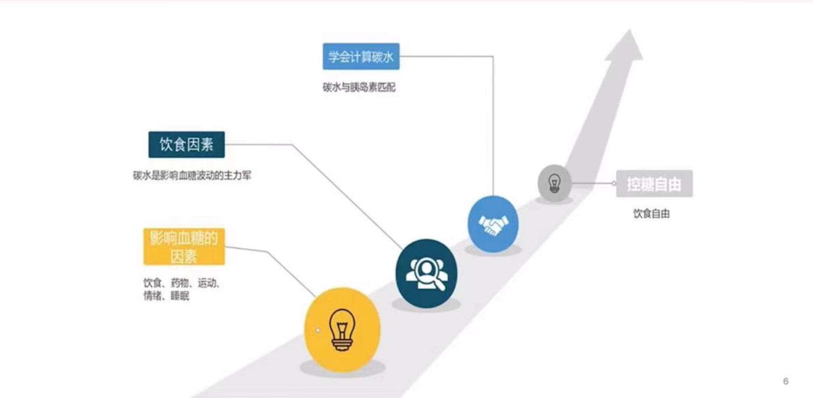
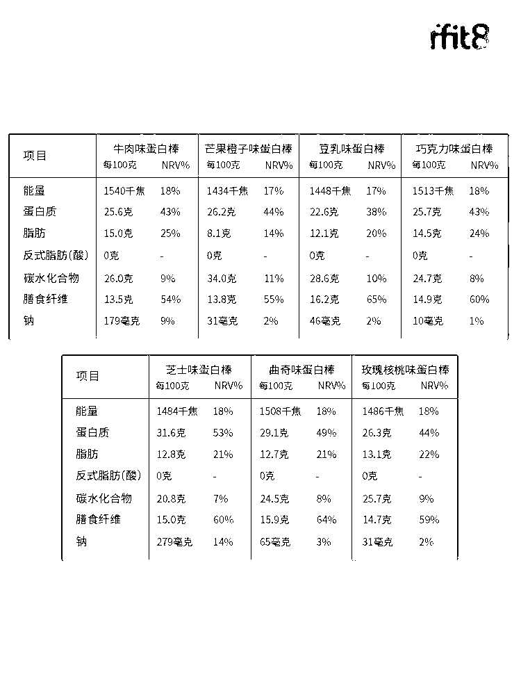
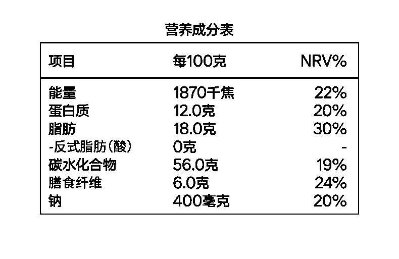
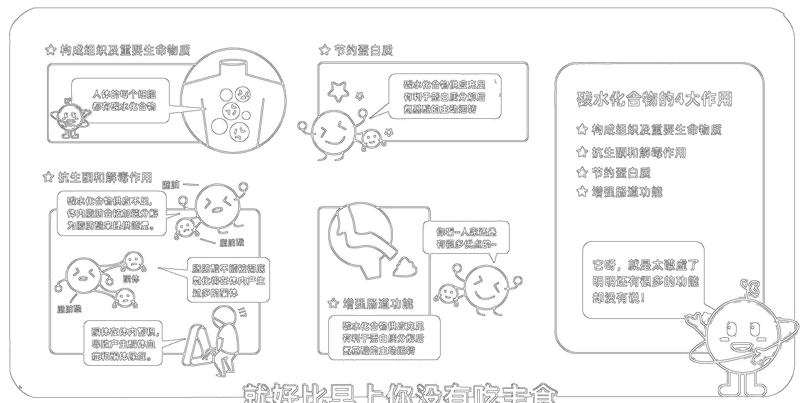
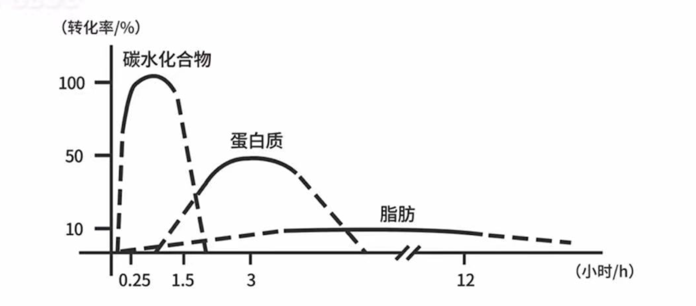

控制血糖的第一步，学会了解碳水和计算碳水

# 为什么要计算碳水
1. **影响血糖的各类因素**
   饮食、药物、运动、心情。
   

      
      <figcaption>图1 影响血糖各类因素</figcaption>
   

# 碳水化合物是什么
碳水化合物是由 **碳**、**氢**、**氧**组成的一大类化合物，通常也叫做**糖类**，主要来源于主食。

但是随着社会发展和大家对美食的渴望，我们当前很多**精致加工的食物**中都包含大量的碳水。
举个例子，**酥脆的饼干**、**不同口味的糖果**，这些还都可以识别出来是碳水化合物。

但是**好吃的火腿肠**、市面上写着**蛋白棒坚果棒**，实际上都是糖油混合物，就是掺杂有大量的碳水化合物。

    <figure style="text-align: center;">
        
        <figcaption>图2 某品牌蛋白棒的成分表</figcaption>
    </figure>
    <figure style="text-align: center;">
        
        <figcaption>图3 某品牌蛋白饼干成分表</figcaption>
    </figure>

所以除了原生态的食物材料我们要学会区分是否为碳水以外，还要学会看**配料表**，不能仅仅被包装上的名字欺骗。
1. **碳水化合物的作用**
   

      
      <figcaption>图4 碳水化合物的功能</figcaption>
   

   
   1. 碳水构成人体组织的重要组成部分
   2. 抗生酮和解毒作用
      - 如果身体中没有足够的碳水分解成葡萄糖来提供能量，就会加速分解脂肪为脂肪酸来提供能力哪个
      - 脂肪酸如果不能被彻底氧化就在体内生成大量酮
      - 酮体在体内蓄积，导致产生**酮体血症**和**酮体尿症**
   3. 节约蛋白质
   4. 增强肠道功能
      - **注意**：蔬菜瓜果中的膳食纤维才可以有这个功能
2. **碳水化合物分类**
   所含分子数越少，我们可以理解为他们越容易被吸收快速提供能量或者转化为葡萄糖进入血液，**直观来说就是升糖速度的快慢**
   1. 糖
    糖包括单糖和双醣
      1. 单糖
        这一类主要葡萄糖、果糖、半乳糖
      2. 双醣
        这一类主要包括蔗糖（葡萄糖+果糖）、麦芽糖（葡萄糖+葡萄糖）和乳糖（葡萄糖+半乳糖）
   2. 寡糖（9个以下葡萄糖分子）
    麦芽糊精等等。
   3. 多糖（10个以及以上葡萄糖分子）
    这一类主要包括淀粉、纤维素 
3. **食物重点讲解**
   我们区分哪些食物可以吃，哪些不可以吃，可以通过查看这个食物所包含的碳水化合物的种类。例如相同碳水化合物的含量相同，如果**单糖**和**双糖**碳水化合物所含比例很高，那么他们会更加容易升高血糖。
# 三大营养素的代谢
三大营养素包括**碳水化合物**、**蛋白质**和**脂肪**，他们都会转化为葡萄糖为人体活动提供能量。但是这三个营养素分解为葡萄糖的转化率和速度都不一样，并且差异很大。

      
      <figcaption>图5 三大营养素的转化率和升糖速率</figcaption>

1. 指标说明
   1. 转化率：通过原始的营养素物质转化为葡萄糖的效率
   2. 转化速率：转化为葡萄糖的速度
   转化率越高，且转化速率越大表明吃完以后，你的血糖会**飞速上升**到较高的数值。
   由于不同的营养素转化速率很不一样，因此你会发现**进食后1个小时**你的血糖还是**稳定的**，突然**2-3个小时后**开始继续**攀升**，这时候可能是你摄入的蛋白质和脂肪开始转化为葡萄糖了。
2. 上述指标差异的原因
   上述三大营养素能量转化率和速度不一致很大一部分原因是因为人体本身消化系统导致的。
   1. 人体消化系统
   消化系统主要包括口腔、食道、胃和肠道组成的。从食物的整个周期来看，他是按照从口腔 -> 食道 -> 胃 -> 肠道的顺序进行消化的。
   **口腔：** 开始分解碳水化合物，唾液腺分泌唾液淀粉酶，对碳水化合物进行部分水解
   **食道：** 继续分解碳水化合物
   **胃：** 继续分解碳水化合物，继续水解；开始利用胃蛋白酶分解蛋白质，分解为氨基酸
   **小肠：** 继续分解碳水化合物，分解为葡萄糖；进行脂肪分解，胆汁和小肠液分解为甘油和脂肪酸被吸收
   2. 三大营养素的升糖特点
   - 碳水化合物：转化率为90% - 100%， 15分钟-2小时会出现血糖上升，根据你的消化能力有关
   - 蛋白质：转化率35%-65%，2小时后会出现血糖波动
   - 脂肪：转化率10%-15%，4小时后出现血糖波动，但是波动应该很小，因为其转化率非常低
# 营养素的常见食物来源
1. 碳水化合物的来源
   1. 谷物类：稻米、高粱、燕麦、小米、玉米、藜麦、紫米等
   2. 薯类：红薯、土豆、紫薯、山药等
   3. 豆类：黄豆、黑豆、青豆、绿豆、鹰嘴豆、红豆、眉豆等
   4. 蔬果类：芒果、苹果、梨、火龙果等
   5. 高淀粉的蔬菜：豌豆、南瓜、胡萝卜、莲藕、菱角、毛豆等
   6. 含糖饮料：果汁、可口可乐、奶茶等
   7. 各种甜品糕点：蛋糕、米糕、饼干、曲奇
   8. 乳制品：牛奶、酸奶、奶酪等
2. 蛋白质的来源
   1. 禽肉类：鸡、鸭、鹅、猪、牛、羊等
   2. 海鲜类：鱼、虾、贝类等
   3. 大豆及大豆制品：黄豆、青豆、黑豆、腐竹、千张等
   **是少有的来自植物的优质蛋白**
   4. 杂豆类：红豆、绿豆、眉豆、鹰嘴豆
   5. 奶类：牛奶、酸奶、奶酪等
3. 脂肪的来源
   1. 油脂类：动物油、植物油
   2. 肉类以及相关制品：肥肉、火腿
   3. 坚果种子：脂肪含量比较高，但是同时会有大量碳水化合物
   **除了莲子和板栗**
   4. 禽肉类：鸡、鸭、鹅、猪、牛、羊等
   5. 蛋类：蛋黄
   6. 鱼类：三文鱼、鳗鱼等

# 参考文献
1. 临床营养学[M] 张爱珍
2. [The next step for impatient insulin dosing: using carbohyrdate to insulin ratios. [J] Diabetes Metab Disord Control. 2015](./参考文献/TheNextStepForImpatientInsulinDosingUsingCarbohyrdateToInsulinRatios.pdf)
