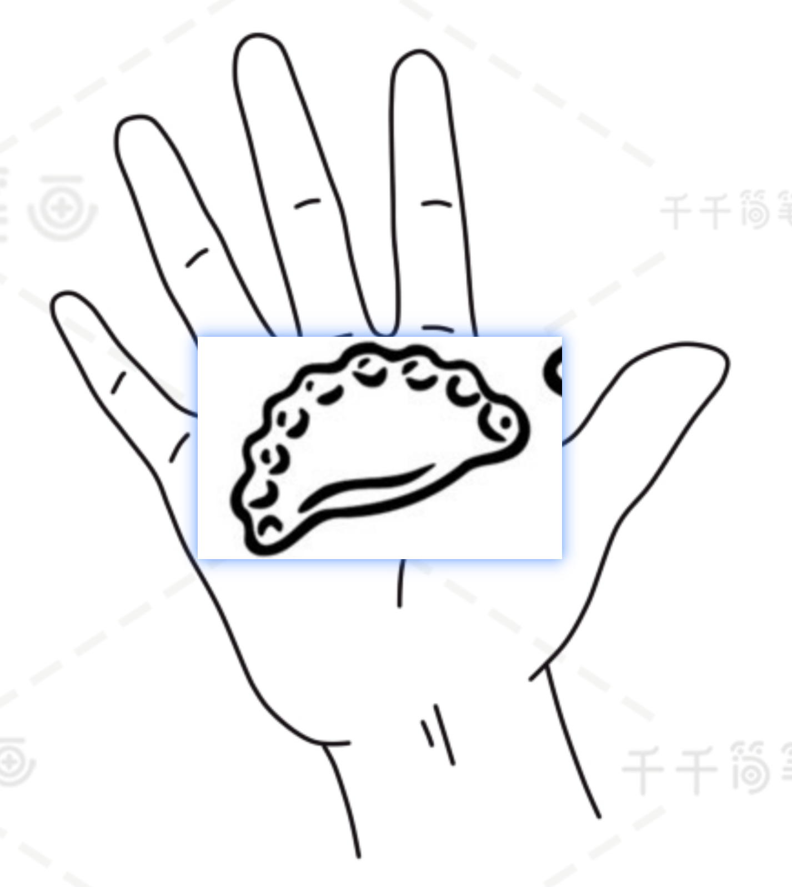
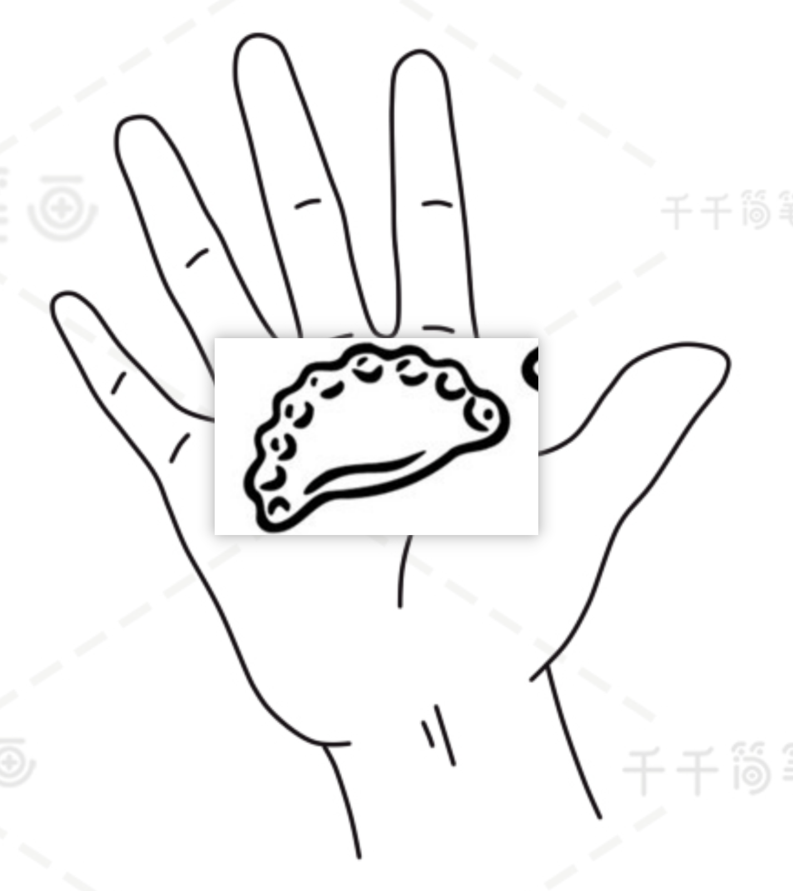
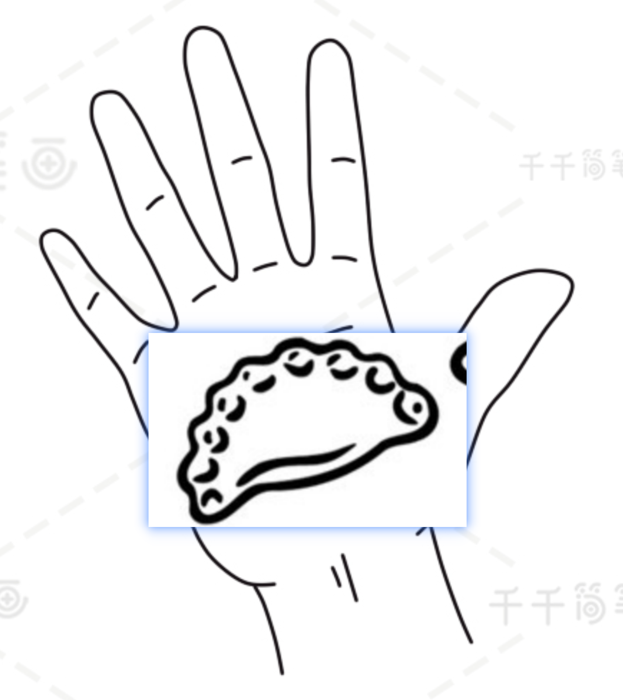

我们在日常生活中还有很多的主食是充满了液体的，例如面条，粥等等，并且不同的软硬稀稠碳水百分比不一样，本节课程将帮助大家了解**如何在日常生活中计算液体碳水**
下面会按照不同类型的主食，分别讲解计算的方式，主要包括：**面食**、**汤饺**以及**煎饼类主食**，大家可以根据自己的饮食习惯来进行学习

# 面食
- 关键数值：**干面条**的碳水百分比为**70%**。
- 实际上我们吃的都是煮熟的面条或者米粉，这里米粉和面条**吸水性能不同**、煮的**软烂程度不同**，所以相同的干面条煮完以后越软烂的吸水越多

|**食物种类**|**软烂程度**|**膨胀系数**|**碳水占比**|**说明**|
|:--------:|:---:|:---:|:---:|:---|
|面条|干|1|70%|标准|
|面条|煮熟硬|3.8|18%|70% / 3.8|
|面条|煮熟软|4.6|15%|70% / 4.6|
|米粉|干|1|63%|标准|
|米粉|煮熟|2.8|23%|63% / 2.8|

表1 不同状态下的面食碳水占比

# 汤饺
- 关键数值：**干饺子皮**的碳水百分比**60%**
- 计算方法：估算煮熟的饺子它的皮在**干皮**时候的重量，乘以上面的**干饺子皮碳水百分比**来计算碳水摄入量
- 那么实现上面计算方法的关键是如何通过饺子的大小估计单个饺子它的干饺子皮重量。

    <figure style="text-align: center;">
        
        <figcaption>图1 7克重饺子煮熟大小 手掌参考</figcaption>
    </figure>
    <figure style="text-align: center;">
        
        <figcaption>图2 5克重饺子煮熟大小 手掌参考</figcaption>
    </figure>
    <figure style="text-align: center;">
        
        <figcaption>图2 9克重饺子煮熟大小 手掌参考</figcaption>
    </figure>

|**食物种类**|**软烂程度**|**膨胀系数**|**碳水占比**|**说明**|
|:--------:|:---:|:---:|:---:|:---|
|饺子皮|干|1|60%|标准|
|饺子皮|煮熟|2|30%|60% / 2|

表2 不同状态下的饺子皮碳水占比

# 粥类
1. 粥比较软烂，容易被胃肠道吸收，因此**升糖快**
2. 家里自己熬粥可以明确下水：米的比例，例如8:1，10:1
3. 吃一碗满满的小碗饭，也就是碗口大小12厘米左右
4. **注意：**不同的米碳水占比不同，煮粥时候如果里面放了菜和肉可以在计算的碳水基础上乘以一定的比例。
5. **常用数据：**如果是常用的小饭碗，不是满满一碗稀白米粥200克左右，碳水含量为 **200克 / 16 * 70% = 8.75克**

|**类型**|**水米比例**|**米类型**|**煮粥的米碳水占比**|**碳水含量**|
|:--------:|:---:|:---:|:---|:---:|
|稠粥|稠|5:1|杂粮|需要查一下|粥的重量 / (5+1) * 杂粮米碳水百分比|
|中度粥|中等|8:1|杂粮|需要查一下|粥的重量 / (8+1) * 杂粮米碳水百分比|
|稀粥|稀|15:1|白米|70%|粥的重量 / (10+1) * 70%|

表3 不同状态下的粥的碳水含量

