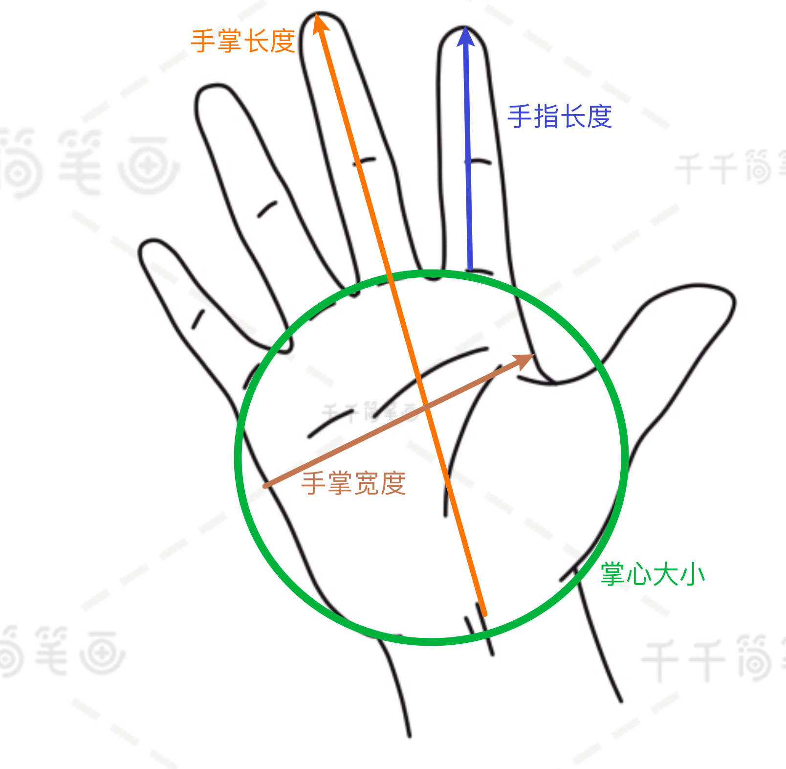
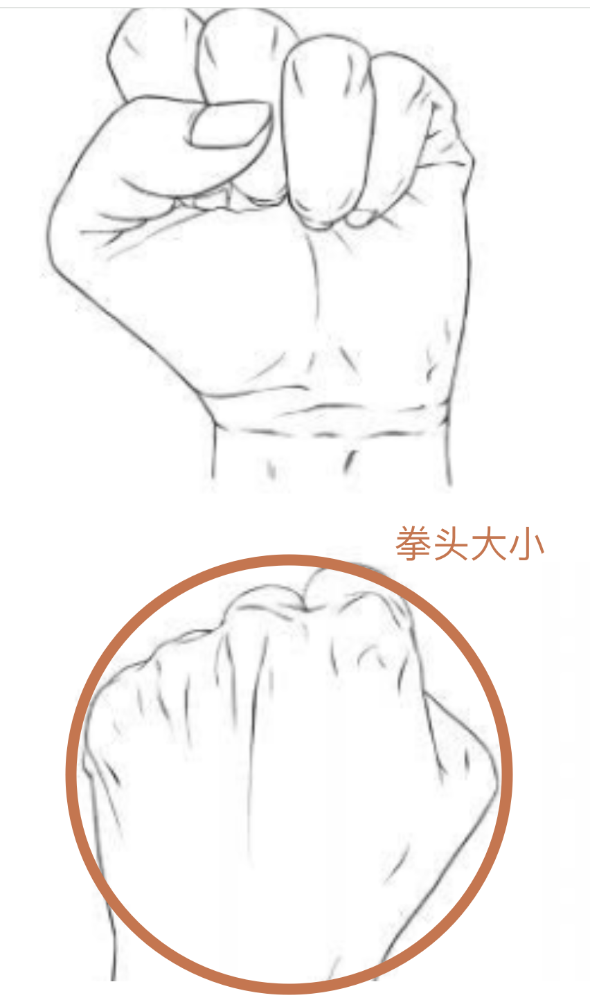

前一课我们了解了什么是碳水化合物以及它对于人体的主要功能，本节课程将帮助大家了解**如何在日常生活中计算碳水**
下面会按照不同类型的主食，分别讲解计算的方式，主要包括：**米面类主食**、**薯类主食**以及**煎饼类主食**，大家可以根据自己的饮食习惯来进行学习

# 常见主食估量参考工具
在我们进行计算之前，需要先对齐估算的各种参考和指标。日常比较方便可以用来估算的工具分为两类：自己身体的一部分（例如拳头、手指），常用器皿（例如小碗）。
**注意：** 这里说的可以用来估算的情况，必须你先进行对齐或者校准。
我们这里举个例子，你根据前期在家的情况下，多次准确测量过自己一拳头对应的米饭是多少克，出门在外的时候就算没有标准的称，你也可以大概估算出米饭的重量，再根据米饭中碳水化合物的比例，估算出大致的碳水摄入克数。

## 第一类 身体量具
1. 手指长度
2. 手掌长度
3. 手掌宽度
4. 手掌厚度
5. 拳头大小
6. 掌心大小

    <figure style="text-align: center;">
        
        <figcaption>图1 手掌参数</figcaption>
    </figure>
    <figure style="text-align: center;">
        
        <figcaption>图2 拳头参数</figcaption>
    </figure>

## 第二类 器皿量具
1. 碗的宽度
2. 碗的深度

# 米面类主食碳水估算
1. **蒸煮类主食 - 米饭**
   1. 一般成年女性拳头大小米饭～150克 碳水～40克
   2. 一般成年男性拳头大小米饭～200克 碳水～50克
   3. 也就是一般来说 煮熟的米饭碳水含量百分比为 **20%-25%**
2. **蒸煮类主食 - 馒头**
   1. 直径和拳头等宽，高度和拳头厚度等厚 ～120克 碳水～60克
   2. 也就是一般来说，馒头无馅料碳水含量百分比为 **50%**
3. **蒸煮类主食 - 包子**
   1. 比拳头略小 ～80克 碳水～20克
   2. 也就是一般来说，包子碳水百分比为 **25%-30%**
4. **蒸煮类主食 - 肠粉**
   1. 肠粉**米浆**做成，升糖比较快
   2. 一般来说，肠粉碳水百分比为**20%**
5. **蒸煮类主食 - 糯米制品**
   1. 主要包括：烧麦、糯米鸡、粽子
   2. 拳头大小的糯米鸡～140克 碳水～40克
   3. 一般来说，糯米制品碳水百分比为**30%-40%**
6. **归纳总结和注意事项**
   |**食物种类**|**碳水占比**|
   |:--------:|:---:|
   |米饭|25%|
   |馒头|50%|
   |肠粉|20%|
   |糯米鸡|30%|
   |烧麦、粽子|40%|
   
表1 蒸煮类主食种类和碳水占比

   1. 注意事项
      1. **肠粉**等白大米磨成浆制作而成，还会添加玉米淀粉，所以肠粉是**高升糖食物**，虽然含碳水比例不是很高，但是**升糖速度快**
      2. **糯米**里面的淀粉是**直链淀粉**，这类淀粉很容易别吸收，所以**升糖速度快**，尽量避免实用

# 薯类主食碳水估算
|**食物种类**|**碳水占比**|
|:--------:|:---:|
|普通南瓜|5%|
|胡萝卜|8%|
|莲藕|11%|
|山药、芋头|13%|
|玉米、土豆、红薯、铁棍山药、鲜豌豆、贝贝南瓜|**20%**|

表2 薯类主食种类和碳水占比

1. 计算这些食物的碳水量的时候需要**基于原始的材料重量**计算，例如红薯烤过以后质量会减轻，这里的20%的碳水占比是按照新鲜红薯来算的，因此需要注意。
2. 南瓜分好多种类，目前市面上主要是那种水分多的普通南瓜和粉糯的贝贝南瓜，他们的碳水比例含量差异很大，建议能够吃**普通南瓜**就吃普通的，如果嘴巴馋可以**一周1、2次**吃一下贝贝南瓜，每次吃的时候**不要超过100克**（这样和大半碗碗白米饭差不多的热量和碳水含量）
3. 100克的食物：
   1. 2/3成年女士拳头米饭 / 糯米鸡 / 烧麦 / 薯类 / 玉米（大拇指长）
   2. 1成年女士拳头肉包子 / 馒头

# 煎饼主食碳水估算
|**食物种类**|**碳水占比**|
|:--------:|:---:|
|肉夹馍|25%|
|油条|50%|
|空心麻球、南瓜饼|50%|

表3 煎饼主食种类和碳水占比

1. 含油脂比较多，升糖虽然**缓慢**，但是**持续时间长**，主要还容易**长胖**