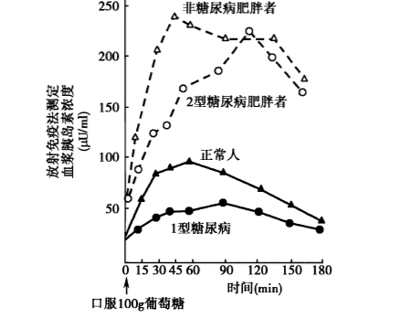
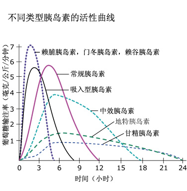
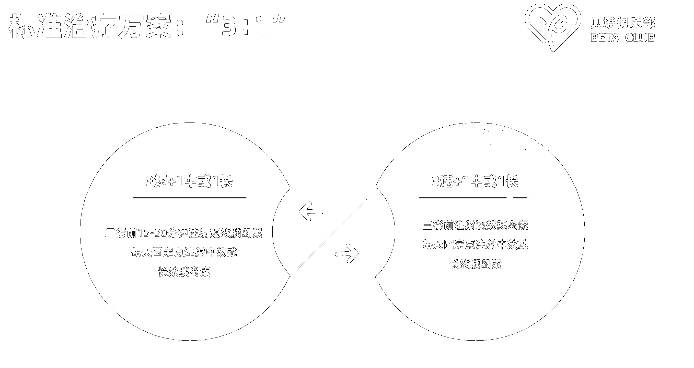
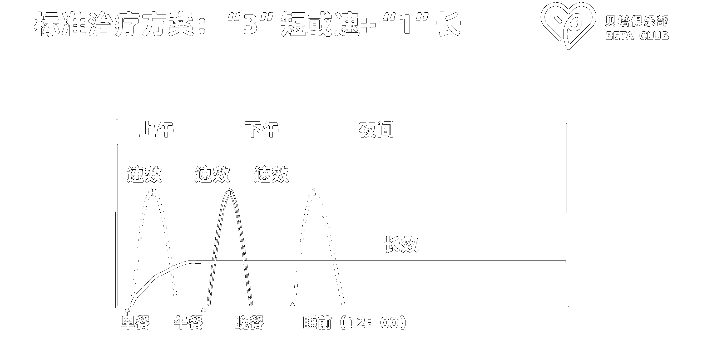
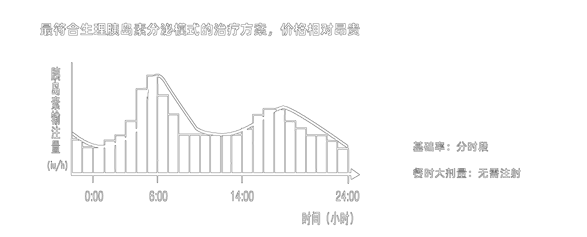
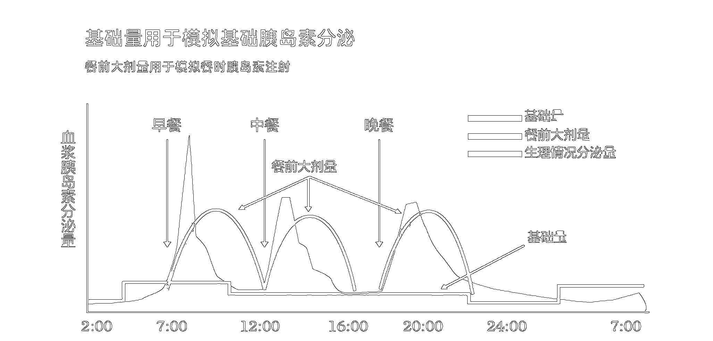

我们每个人饮食不同，并且对相同食物的反应不一样，从而导致我们看到的每日血糖曲线差异很大。但是，这不代表血糖是**随机的**，它是**有迹可循**，存在内部规律的。因此我们可以根据正常人群、1型-糖尿病患者和2型-糖尿病患者，以及病患的严重程度、不同饮食通过外部胰岛素的辅助来调控血糖，使得血糖曲线**接近正常人**的情况。
只有充分了解胰岛素是什么，胰岛素的特点以及自身血糖曲线产生的原因，才能根据曲线变化利用外源胰岛素实现血糖的正常波动，避免血糖**过高**、**过低**或者**波动频繁**的现象，让每一个读者都能够过上健康稳定的生活。

---

# 1. 什么是胰岛素
## 1.1 胰岛素的作用
**胰岛素**是由胰腺中的**β细胞**分泌的一种重要激素，负责调节血糖水平。它的主要作用是：
1. **降低血糖**：胰岛素通过促进葡萄糖进入肌肉、脂肪和肝脏细胞，帮助将血液中的葡萄糖转化为能量或储存为糖原。
2. **储存能量**：胰岛素促进脂肪储存，抑制脂肪分解，并刺激蛋白质合成，从而维持身体的正常代谢。
3. **调节肝糖原代谢**：在肝脏中，胰岛素促使葡萄糖储存为糖原，并抑制糖原分解，防止血糖过度上升。

## 1.2 正常人群的胰岛素功能
在健康人群中，胰岛素的分泌和作用是**精确调节的**：
- **血糖升高**（例如进餐后）：胰岛素迅速分泌，帮助细胞吸收葡萄糖，将血糖水平恢复到正常范围。
- **血糖恢复正常**：胰岛素分泌减少，保持血糖稳定。

## 1.3 1型糖尿病
**1型糖尿病**是一种自身免疫性疾病，身体的免疫系统错误地攻击和破坏了胰腺中的**β细胞**，导致胰岛素分泌不足或完全缺乏。
### 1型糖尿病的特点：
- **胰岛素缺乏**：由于β细胞被破坏，无法分泌足够的胰岛素。
- **血糖水平升高**：由于缺乏胰岛素，葡萄糖无法进入细胞，导致血糖升高。
- **需要胰岛素治疗**：1型糖尿病患者需要终生依赖外源性胰岛素来维持血糖水平。

### 1.4 1型糖尿病的机制：
- 胰岛素分泌完全或接近为零。
- 葡萄糖无法进入细胞，导致血糖持续升高。

## 1.5 2型糖尿病
**2型糖尿病**的主要特点是**胰岛素抵抗**，即身体细胞对胰岛素的敏感性下降，虽然胰腺能够分泌胰岛素，但其作用效果减弱。

### 2型糖尿病的特点：
- **胰岛素抵抗**：细胞对胰岛素不敏感，导致葡萄糖无法有效进入细胞。
- **胰岛素分泌增加**：为了弥补胰岛素抵抗，胰腺会分泌更多的胰岛素，试图维持正常血糖水平。
- **长期β细胞衰竭**：随着病程进展，胰腺的β细胞功能逐渐下降，胰岛素分泌减少。

### 2型糖尿病的机制：
- 初期胰岛素分泌正常或增加，但细胞对其作用不敏感。
- 随着时间推移，β细胞功能衰竭，胰岛素分泌减少，导致血糖失控。

表1 关键差异总结

| 特点         | 正常人             | 1型糖尿病患者              | 2型糖尿病患者              |
|--------------|--------------------|----------------------------|----------------------------|
| **胰岛素分泌** | 正常               | 胰岛素缺乏（完全或接近为零） | 胰岛素最初过多，后期减少   |
| **胰岛素功能** | 正常               | 无胰岛素功能                 | 胰岛素抵抗，作用效果减弱   |
| **病因**      | 无疾病影响         | 自身免疫系统攻击胰岛β细胞    | 胰岛素抵抗，胰岛功能逐渐衰竭 |
| **血糖水平**  | 正常调节           | 持续升高                    | 早期高胰岛素、晚期高血糖   |
| **治疗方法**  | 不需要             | 终生依赖外源性胰岛素         | 生活方式管理、药物，后期可能需要胰岛素 |
| **疾病机制**  | 胰岛素和细胞正常运作 | 无法分泌胰岛素，血糖无法被控制 | 胰岛素抵抗，葡萄糖无法被有效利用 |
| **典型发病年龄** | 任意年龄         | 青少年时期或儿童期           | 中老年人群为主，但年轻人发病率增加 |

## 1.6 总结：
- **正常人**：胰岛素分泌与作用平衡，血糖保持在正常范围内。
- **1型糖尿病**：由于自身免疫系统攻击，胰腺不能分泌胰岛素，需要外源性胰岛素来控制血糖。
- **2型糖尿病**：最初存在胰岛素抵抗，胰腺需要分泌更多的胰岛素来维持血糖水平，但随着时间推移，胰岛功能下降，血糖失控。

---

# 2. 不同人群的胰岛能力指标
OGTT（口服葡萄糖耐量试验）和胰岛素释放实验是两项常用于检测糖尿病和胰腺功能的医学测试。它们帮助评估身体处理葡萄糖的能力以及胰岛素的分泌情况。以下是对这两项实验的详细解释
## 2.1 OGTT 口服葡萄糖耐量试验
1. 定义：
    **OGTT**（Oral Glucose Tolerance Test，口服葡萄糖耐量试验）是一种检测身体对葡萄糖摄入反应的实验。它常用于诊断*糖尿病*或*糖尿病前期*，尤其是*妊娠糖尿病*。
2. 测试过程：
   1. 空腹：测试开始时，患者需要空腹**8小时以上**（通常在早晨进行），医生会先测量空腹血糖水平。
   2. 摄入葡萄糖溶液：患者需要口服一杯含有**75克**葡萄糖的溶液。
   3. 定时测量血糖：在接下来的**2小时内**，医生会定期抽取血样，通常在服用葡萄糖后的*30分钟*、*60分钟*、*90分钟*和*120分钟*时测量血糖水平。
3. 解读结果：
   - 正常耐量：2小时后血糖应*低于7.8 mmol/L*。
   - 糖尿病前期：2小时后血糖在*7.8到11.0 mmol/L之间*。
   - 糖尿病：2小时后血糖*大于11.1 mmol/L*。
## 2.2 IRT 胰岛素释放实验
1. 定义：
    **IRT**（Insulin Release Test）胰岛素释放实验用于评估人体在摄入葡萄糖后的胰岛素分泌反应。它通常与OGTT联合使用，以检查胰腺的β细胞功能和胰岛素敏感性。
2. 测试过程
   1. 空腹采血：首先采集**空腹血样**，以测定基础胰岛素水平。
   2. 口服葡萄糖溶液：患者需要口服与OGTT相同的**75克**葡萄糖溶液。
   3. 定时采血：在服用葡萄糖后的*30分钟*、*60分钟*、*90分钟*和*120分钟*时，定期采集血样，测定胰岛素的分泌水平。
3. 解读结果
   - 正常：胰岛素水平会在摄入葡萄糖后迅速升高，达到峰值后逐渐下降。
   - 胰岛素抵抗：如果血糖升高且胰岛素水平显著增加，说明身体对胰岛素不敏感，存在胰岛素抵抗。
   - 胰岛功能受损：如果胰岛素分泌不足，说明胰岛β细胞功能可能受损，可能导致2型糖尿病。

        <figure style="text-align: center;">
            
            <figcaption>图1 胰岛素释放试验中正常人、非糖尿病肥胖者、1型糖尿病及2型糖尿病患者血浆胰岛素浓度对比</figcaption>
        </figure>

---

# 3. 外源性胰岛素
胰岛素有以下不同的特性：
1. 开始作用时间（**多快**开始起作用）
2. 峰值时间 （多长时间起到**最大作用**）
3. 持续时间 （**作用时间**多长）
4. 浓度 （在美国市售的胰岛素是每毫升100单位，或100U。在其他国家，浓度则有不同。注意：要从其他国家买胰岛素，一定要U100的）
5. 给药途径 (是皮下注射还是静脉给药)

胰岛素通常注射到皮下脂肪组织，就是常说的皮下注射。

## 3.1 胰岛素分类
胰岛素分三大类： 速效、中效和长效胰岛素

### 3.1.1 速效胰岛素
不论剂量大小，其**起效时间**和**到达峰值时间**保持**不变**，但作用**持续时间**与剂量**有关**。注射几个单位则持续4小时或更短，25–30单位则会持续5–6小时。一般来说，速效胰岛素作用持续4小时左右。
- 被皮下脂肪组织快速吸收入血
- 用来控制进食或加餐时的血糖，或用来纠正高血糖
- **速效胰岛素类似物**：门冬胰岛素，赖脯胰岛素，赖谷胰岛素
- **常规胰岛素**

### 3.1.2 中效胰岛素
- 吸收相对缓慢，持续时间较长。
- 用来控制隔夜，空腹和餐间血糖。
- **中性鱼精蛋白锌人类胰岛素(NPH)**很小的剂量会较早达到峰值，并且持续时间较短，而大剂量会较晚达到峰值，并且持续时间延长。

### 3.1.3 长效胰岛素
- 吸收缓慢，峰值极小，有平台曲线效应，可持续将近一整天。
- 用来控制隔夜、空腹和餐间血糖。

## 3.2 不同胰岛素的特性

|胰岛素种类|胰岛素名称|起效时间|峰值时间|延续时间|外观|
|:-------:|:------------------------:|:-----:|:-----:|:-----:|:-----:|
|速效胰岛素|门冬胰岛素，赖脯胰岛素，赖谷胰岛素|5-15分钟|1-2小时|4-6小时|透明|
|速效胰岛素|常规胰岛素|0.5-1小时|2-4小时|6-8小时|透明|		
|中效胰岛素｜人类胰岛素|1-2小时|6-10小时|12+小时|混浊|		
|长效胰岛素|地特胰岛素|1小时|平顶，5小时|12-24小时|透明|
|长效胰岛素|甘精胰岛素|1.5小时|平顶，5小时|24小时|透明|

        <figure style="text-align: center;">
            
            <figcaption>图2 不同胰岛素活性曲线</figcaption>
        </figure>

---

# 4. 1型-糖尿病患者的胰岛素治疗方案
## 4.1 标准治疗方案1 3+1

        <figure style="text-align: center;">
            
            <figcaption>图3 1型糖尿病标准治疗方案3+1</figcaption>
        </figure>
        <figure style="text-align: center;">
            
            <figcaption>图4 3+1方案胰岛素作用曲线</figcaption>
        </figure>

## 4.2 标准治疗方案2 皮下胰岛素泵
**最符合生理性**胰岛素分泌模式的治疗方案
- 特点：
  - 分时段进行注射基础率，基础率按照小时分为24个时段
  - **不需要打针**注射胰岛素
  - **随时** 追加胰岛素剂量

        <figure style="text-align: center;">
            
            <figcaption>图3 1型糖尿病标准治疗方案 皮下胰岛素泵</figcaption>
        </figure>
        <figure style="text-align: center;">
            
            <figcaption>图3 1型糖尿病标准治疗方案 具体模拟效果</figcaption>
        </figure>

## 4.3 非标准质量方案
- 蜜月期治疗方案 口服药 + 中效/长效胰岛素
- 预混方案，*不推荐I型糖尿病人*使用
