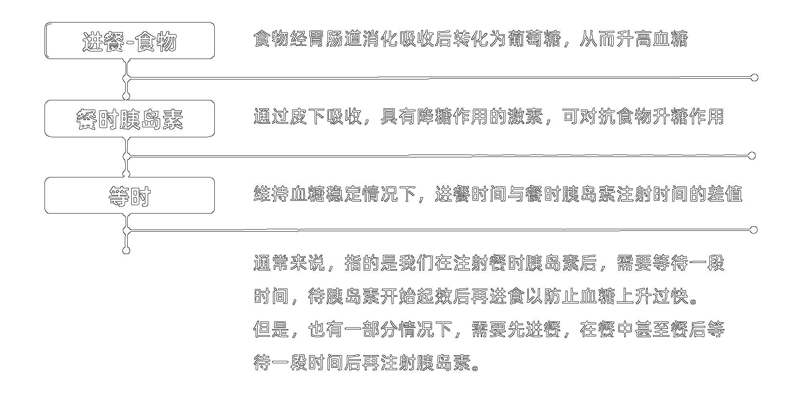
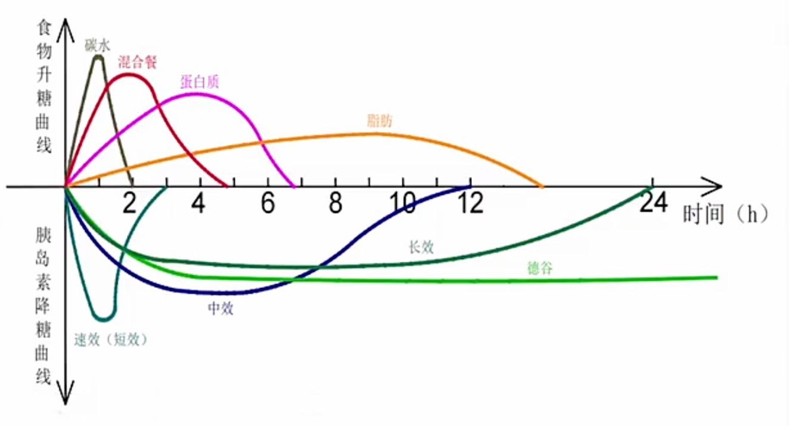
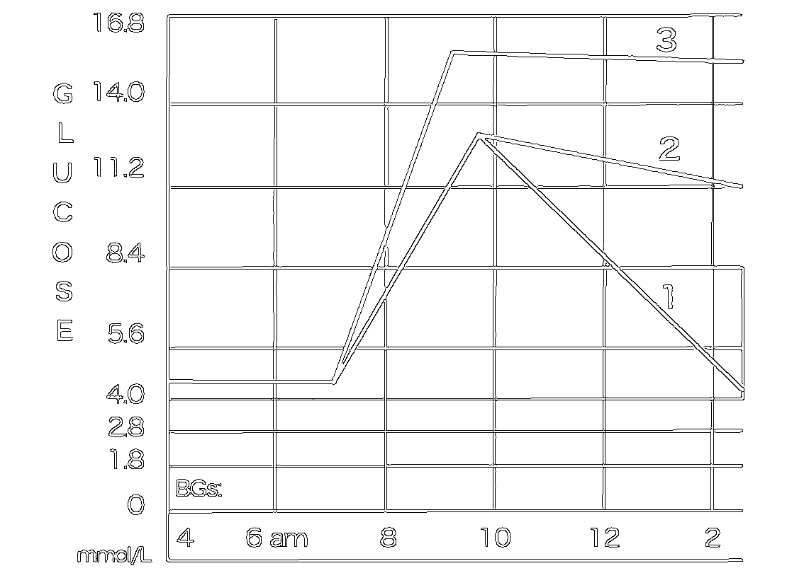
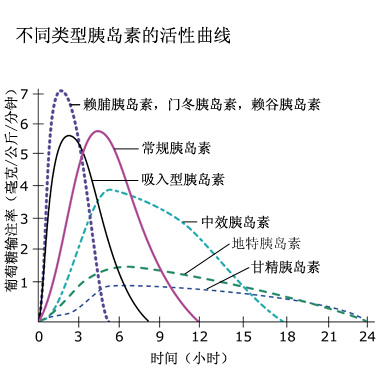
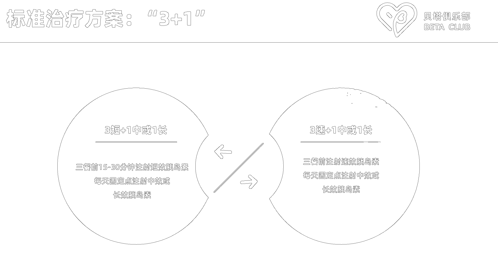
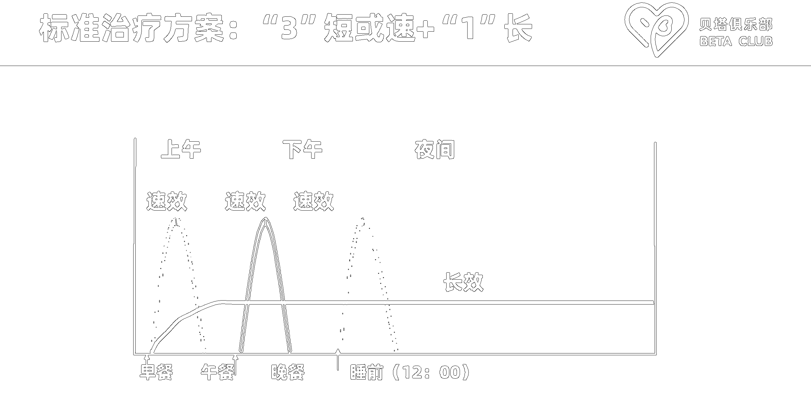
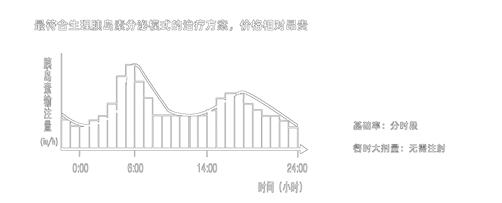
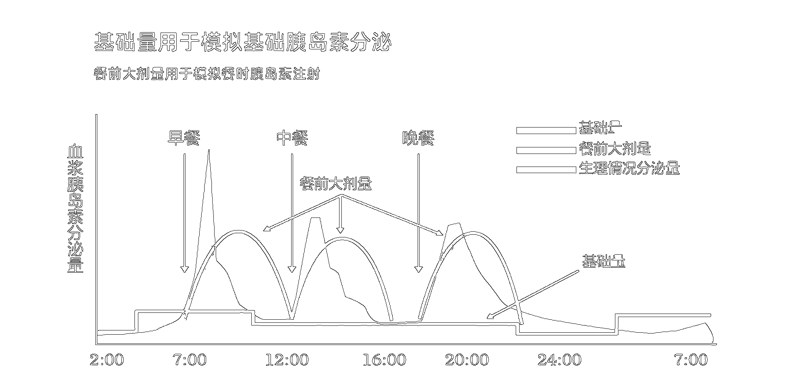

📘 本课目标：理解“等时”（胰岛素注射时间与进餐时间的匹配）在胰岛素与食物血糖反应匹配中的作用，识别何时需调整注射时间或饮食内容。

上一节课我们了解了什么是胰岛素，胰岛素的作用以及正常人的胰岛素分泌和血糖情况，这堂课我们主要探索**胰岛素降糖高峰**和**食物升糖高峰作用**之间的*时间*关系，也就是通俗来讲的**等时方法**（注射胰岛素的时间与进餐时间的匹配）

通过利用等时的方法，结合外源胰岛素有效处理饮食导致的血糖上升，并学会如何判断是否需要调整胰岛素的摄入量。

⚠️ 温馨提示：本文内容仅用于学习与医生沟通参考，具体胰岛素调整请遵循专业医嘱。

**注意**：这里*不是推荐自己修改*医生处方，改动自己的胰岛素注入量，而是通过分析*和医生进行沟通*判断下一阶段的注射量是否需要修改，以及在多大的范围内可以自己进行调整

---

# 1. 什么是“等时”（胰岛素注射时间与进餐时间的差值）
主要描述**餐食胰岛素注射时间**和**进餐时间**之间的差值

### 图1：等时的概念

---

# 2. 等时的目的

✅ **目的1：协调胰岛素降糖与食物升糖时间**

✅ **目的2：避免餐后血糖剧烈波动**

✅ **目的3：避免不必要的胰岛素追加与低血糖风险**

**等时**可能是食物等待胰岛素，也可能是胰岛素等待食物

通过**等时**达到胰岛素降糖作用和食物升糖作用相互制衡，从而维持住餐后血糖始终保持相对稳定的一个状态。

一般来说：

- 若食物**升糖快**，则需要**先**注射胰岛素，等待胰岛素开始起效后再进食

- 若食物**比较难消化**或者患者**胃肠道消化吸收能力差**，则需要在**餐中、餐后或餐后等待一段时间**进行胰岛素注射，避免胰岛素过快起效而食物还没有带来升糖导致的血糖先过低后升高无法下降

## 2.1 匹配胰岛素降糖曲线和食物升糖曲线

### 图2：等时的目的匹配升糖和降糖作用曲线图

## 2.2 防止餐后血糖波动过大

详细说明下餐后血糖的4种情况。

### 情况1：餐后平稳达标 ✅（理想状态）

这是我们的目标状态。

### 情况2：餐后低血糖 ⚠️（胰岛素过量）

胰岛素打多了导致餐后血糖过低。

### 情况3：餐后先高后低 ⏳（等时不够）

胰岛素没有来的及生效，食物的升糖快。

1. **曲线1**可以看出，**早上用餐完成后**血糖升高到了**异常**高值，但是**中午**用餐前**恢复**到了3.7-8.4这个区间内，并且过后到**下午2点**恢复到了**正常空腹血糖值**，说明：胰岛素剂量**足够**，但是**等时不够**，血糖上升过快胰岛素没有来的及起效追上血糖的上升。

2. **曲线2**可以看出，**早上用餐完成后**血糖升高到了**异常**高值，并且**中午**用餐前也**没有恢复**到了3.7-8.4这个区间内，并且过后到**下午2点**都**没有恢复**到**正常空腹血糖值**，说明：胰岛素剂量**不足**，并且**等时不够**，血糖上升过快胰岛素没有来的及起效追上血糖上升，且后续胰岛素最大作用后也没有成功进行降糖到正常水平。

3. **曲线3**可以看出，**早上用餐完成后**血糖急速上升到了**超级异常**高值，并且**中午**用餐前**持续飘高**到了中度高血糖这个区间内，并且过后到**下午2点**持续**中度高血糖**，说明：胰岛素剂量**不足**，而且**等时不够**，并且这一餐的饮食需要进行调整，碳水量过多且蛋白质脂肪也大，所以导致血糖持续不下。 

### 图3：餐后先高后低的情况说明曲线

### 情况4：餐后先低后高 ⏰（等时过长）

胰岛素已经明显生效，但是食物的升糖作用还没起效。

## 2.3 节省胰岛素用量

若出现餐后低血糖或者先低后高，那么就会追加加餐来提升血糖，但是可能出现矫枉过正血糖升的过高而追加额外的胰岛素。

若出现餐后血糖骤然飙升，然后直接追加胰岛素会导致低血糖的风险。

---

# 3. 等时的影响因素

食物的类型、进餐的时间、消化能力和胰岛素的起效速度（指胰岛素开始发挥作用的时间）来确定究竟是否需要等时，以及需要等时的长度。

- 若食用**单一高碳水化合物**（如果汁、奶茶、粥、面包、蛋糕等）；或者食用**液体类高碳水食物**（例如汤面、汤粉、云吞等），可能需要利用等时间，例如**先打胰岛素**过段时间再进行饮食，为的就是等待胰岛素起作用时间和升糖一致起来。

- 若在早上进餐，此时消化能力是最强的，因为空腹肚子饿当前吸收好，所以需要考虑：

1. 开始作用时间（**多快**开始起作用）

2. 峰值时间 （多长时间起到**最大作用**）

3. 持续时间 （**作用时间**多长）

4. 浓度 （在美国市售的胰岛素是每毫升100单位，或100U。在其他国家，浓度则有不同。注意：要从其他国家买胰岛素，一定要U100的）

5. 给药途径 (是皮下注射还是静脉给药)

胰岛素通常注射到皮下脂肪组织，就是常说的皮下注射。

## 3.1 胰岛素分类

胰岛素分三大类： 速效胰岛素（起效快，餐时使用）、中效胰岛素和长效胰岛素。

### 3.1.1 速效胰岛素（快速起效，适合餐前注射）

不论剂量大小，其**起效时间**和**到达峰值时间**保持**不变**，但作用**持续时间**与剂量**有关**。注射几个单位则持续4小时或更短，25–30单位则会持续5–6小时。一般来说，速效胰岛素作用持续4小时左右。

- 被皮下脂肪组织快速吸收入血

- 用来控制进食或加餐时的血糖，或用来纠正高血糖

- **速效胰岛素类似物**：门冬胰岛素，赖脯胰岛素，赖谷胰岛素

- **常规胰岛素**

### 3.1.2 中效胰岛素

- 吸收相对缓慢，持续时间较长。

- 用来控制隔夜，空腹和餐间血糖。

- **中性鱼精蛋白锌人类胰岛素(NPH)**很小的剂量会较早达到峰值，并且持续时间较短，而大剂量会较晚达到峰值，并且持续时间延长。

### 3.1.3 长效胰岛素

- 吸收缓慢，峰值极小，有平台曲线效应，可持续将近一整天。

- 用来控制隔夜、空腹和餐间血糖。

## 3.2 不同胰岛素的特性

下表总结了常见胰岛素的关键特性，帮助判断注射时间与等时匹配策略：

|胰岛素种类|胰岛素名称|起效时间（开始作用时间）|峰值时间（最大作用时间）|延续时间（作用持续时间）|外观|
|:-------:|:------------------------:|:-----:|:-----:|:-----:|:-----:|
|速效胰岛素|门冬胰岛素，赖脯胰岛素，赖谷胰岛素|5-15分钟|1-2小时|4-6小时|透明|
|速效胰岛素|常规胰岛素|0.5-1小时|2-4小时|6-8小时|透明|		
|中效胰岛素｜人类胰岛素|1-2小时|6-10小时|12+小时|混浊|		
|长效胰岛素|地特胰岛素|1小时|平顶，5小时|12-24小时|透明|
|长效胰岛素|甘精胰岛素|1.5小时|平顶，5小时|24小时|透明|

### 图2：不同胰岛素活性曲线

---

# 4. 什么情况需要等时

根据不同治疗方案，等时的需求和策略有所不同。

## 4.1 标准治疗方案 3+1：每日三次餐前+一次基础胰岛素注射

此方案通过餐前注射速效胰岛素控制餐后血糖，基础胰岛素维持全天血糖稳定。

### 图4A：1型糖尿病标准治疗方案3+1

### 图4B：3+1方案胰岛素作用曲线

## 4.2 标准治疗方案 皮下胰岛素泵：最符合生理性胰岛素分泌模式的治疗方案

胰岛素泵通过连续皮下注射基础胰岛素，并可随时追加，模拟人体自然胰岛素分泌。

- 特点：

  - 分时段进行注射基础率，基础率按照小时分为24个时段

  - **不需要打针**注射胰岛素

  - **随时** 追加胰岛素剂量

### 图5A：1型糖尿病标准治疗方案 皮下胰岛素泵

### 图5B：1型糖尿病标准治疗方案 具体模拟效果

## 4.3 非标准治疗方案

- 蜜月期治疗方案：口服药 + 中效/长效胰岛素

- 预混方案，*不推荐I型糖尿病人*使用
