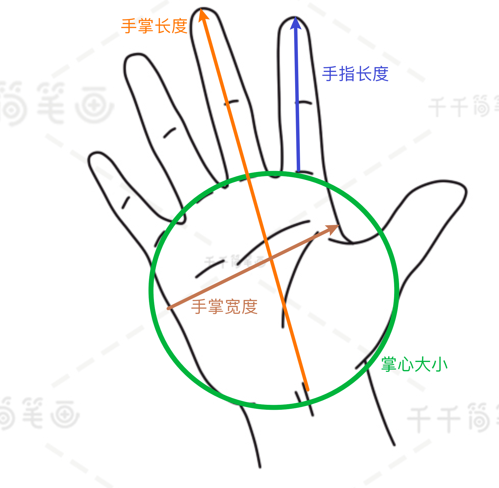
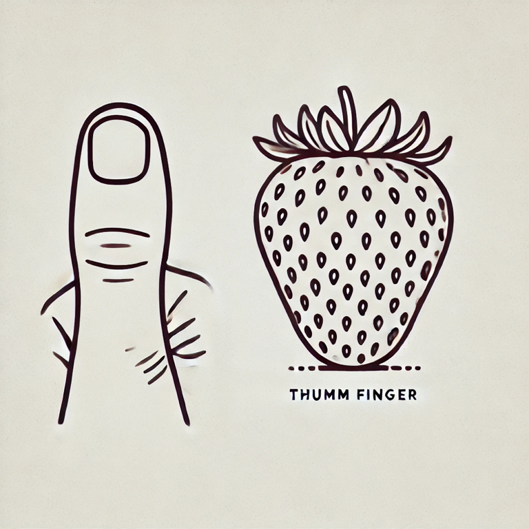
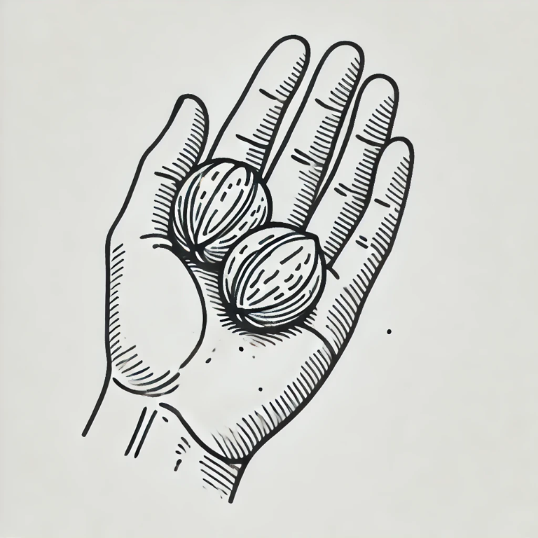
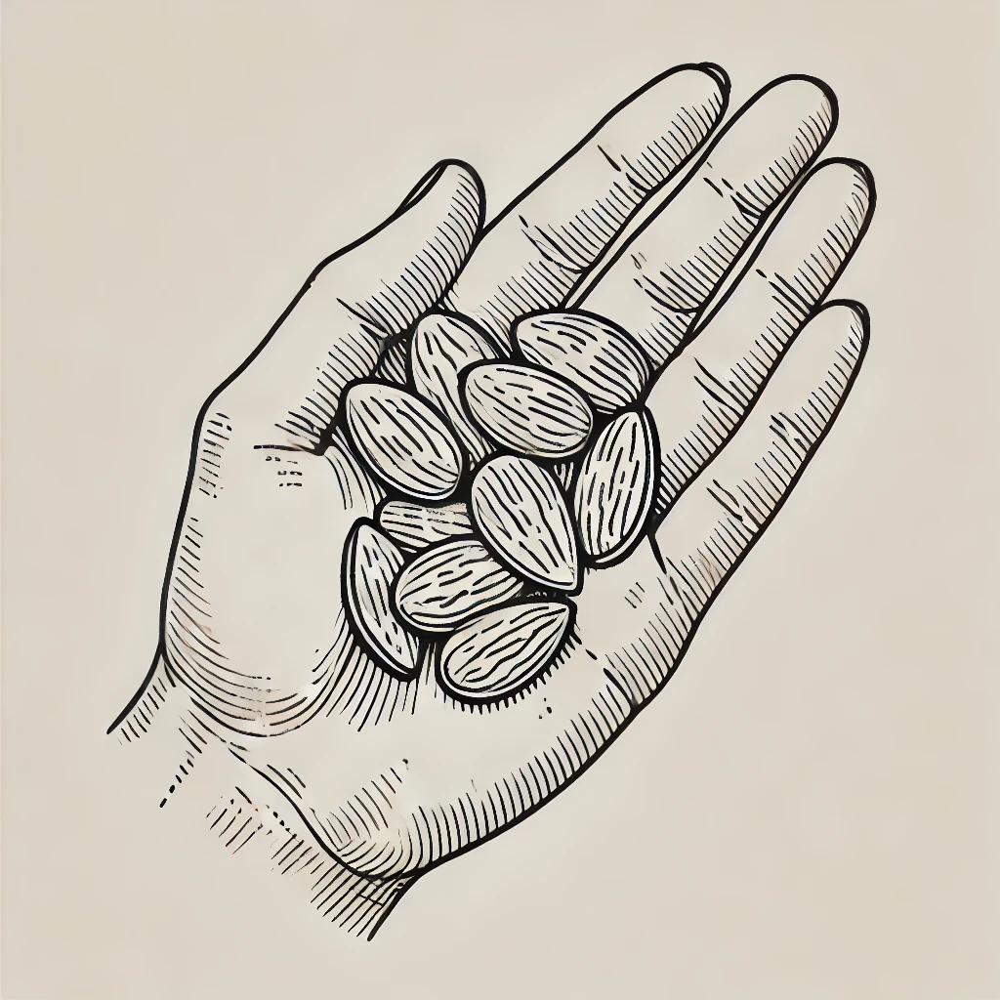
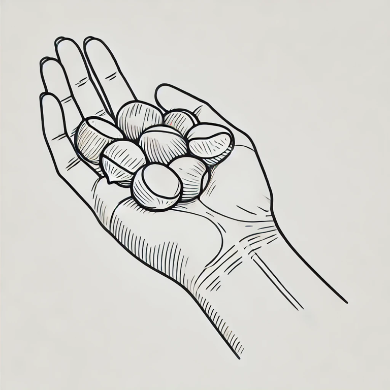
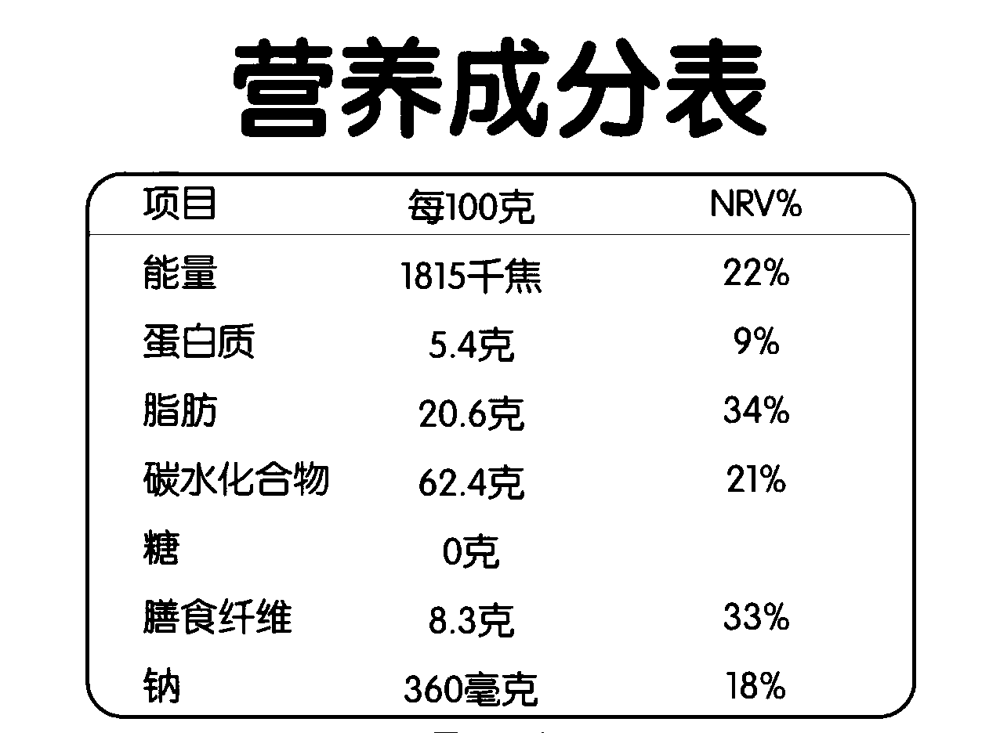

我们在日常生活中还有很多情况是在两餐正餐之间添加零食来进行少量补给，本节课程将帮助大家了解**如何在日常生活中计算加餐零食的碳水**
下面会按照不同类型的加餐零食，分别讲解计算的方式，主要包括：**水果类**、**坚果类**以及**非标签零食和标签零食**，大家可以根据自己的饮食习惯来进行学习

# 水果类
## 大型水果
包括：橙子、苹果、梨子、番石榴（芭乐）。大型水果只是表明**单果**的重量基本**超过100克**。
### 估算克重方法

    <figure style="text-align: center;">
        
        <figcaption>图1 手掌掌心</figcaption>
    </figure>
    <figure style="text-align: center;">
        
        <figcaption>图2 拳头大小</figcaption>
    </figure>

### 估算关键数值
主要需要使用到的关键数值为以下2个：
1. **可食用比例**：一般水果都存在外皮或者核，属于不能食用部分，我们需要计算出可食用的重量，然后利用可食用部分的碳水比例来计算实际摄入的碳水克数。
2. **碳水占比**：可食用部分的碳水占比。

表1 不同大型水果的关键数值

|**水果名称**|**可食用比例**|**碳水占比**|**常见单个克重**|
|:--------:|:---:|:---:|:---:|
|橙子|80%|10%|100克|
|苹果|75%，*注意*：有些人其实吃苹果不削皮|14%|150克-200克|
|芭乐、番石榴|100%|14%|～180克|
|梨子|90%|13%|～300克|

## 小型水果
包括：砂糖橘、火龙果、草莓。小型水果只是表明**单果**的重量基本**低于100克**。
**注意：** 火龙果是升糖比较快的
### 估算克重方法

表2 不同小型水果的关键数值

|**水果名称**|**可食用比例**|**碳水占比**|**常见单个克重**|
|:--------:|:---:|:---:|:---:|
|砂糖橘|80%|10%|100克|
|火龙果|50%|12%|320克|
|草莓|100%|7%|～20克|

    <figure style="text-align: center;">
        
        <figcaption>图3 草莓20克对应大小</figcaption>
    </figure>

# 坚果类

表3 不同坚果的关键数值

|**坚果名称**|**可食用比例**|**碳水占比**|**常见单个克重**|
|:--------:|:---:|:---:|:---:|
|核桃|50%|20%|15克|
|杏仁|100%|20%|1克|
|**板栗**|80%|50%|～8克|

    <figure style="text-align: center;">
        
        <figcaption>图3 7克重饺子煮熟大小 手掌参考</figcaption>
    </figure>
    <figure style="text-align: center;">
        
        <figcaption>图4 2/3手掌参考 10颗</figcaption>
    </figure>
    <figure style="text-align: center;">
        
        <figcaption>图5 一手掌栗子 30g左右碳水 手掌参考</figcaption>
    </figure>

# 非标签类食物
## 蛋糕
1. 厚度为**2厘米**的奶油蛋糕差不多为**70克**，如果奶油比较多，血糖会容易出现**后升**

## 炸鸡翅
1. 单个炸鸡翅差不多为**40克**，但是可食用部分差不多为**26克**，可食用重量占比**65%**
3. 可食用部分的碳水百分比为**12%**，主要的碳水来源于鸡翅外面的**面衣**

## 售卖零食
1. **学会查看营养成分表**
   营养成分表是帮助消费者了解所购买食品中每种营养成分含量的有用工具，尤其在控制碳水化合物、脂肪、蛋白质等摄入量时尤为重要
	- 零食的主要碳水化合物来源往往包括**淀粉**和**糖分**，尤其是加工食品如饼干、薯片和糖果。
	- 阅读碳水化合物部分时，注意其分为**总碳水化合物**和**糖**。通常，糖含量较高的零食其总碳水化合物也偏高。
2. **通过营养成分表的计算公式**
   实际摄入的碳水化合物 = 每100克碳水含量 × 食用克数 ÷ 100
3. **举例**
   1. “0糖”奥利奥

    

        <figure style="text-align: center;">
            
            <figcaption>图6 “0糖”奥利奥营养成分表</figcaption>
        </figure>
    

    2. 如果您实际食用了**60克**该零食，计算摄入的碳水化合物量如下：
        实际摄入碳水化合物 = 62.4克 × 60克 ÷ 100 = 37.44克
4. **如何计算你吃了多少克**
   1. 如果有是一整包，但是内部有小包装，买到手先计算单个包装的克重是多少 
      - **单包重量** = **整包重量** ÷ **小包份数**
   2. 如果每个小包装内部的食物是类似奥利奥可以数出片数的，可以计算单片重量
      - **单片重量** = **单包重量** ÷ **单包食物数量**
   3. 如果每个小包装内部的食物无法数出具体的片数，你也记不住你吃了几片
      - 那么自己要记得你吃的体积差不多是这个包装的占比